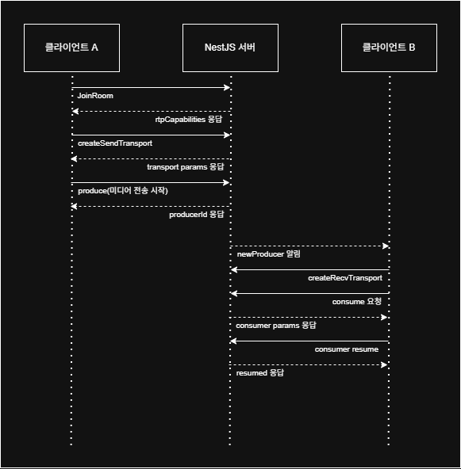
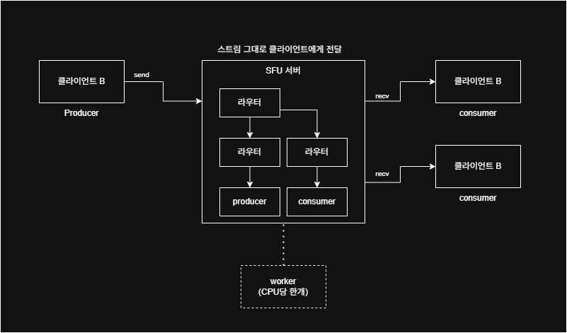

## Description
Nestjs와 mediasoup, socket을 이용한 실시간 채팅 및 화면 공유 서비스

## Tech Stack

Backend


RealTime


## Architecture




## Features

- mediasoup를 이용한 영상 통화
- mediasoup를 이용한 화면 공유
- nestjs로 만든 웹 소켓 시그널링 서버 
- 방기준 세션 관리
- Producer / Consumer media pipeline
- Peer in-memory 저장 관리
- JWT기반 인증 및 소켓 인증

## Installation

```bash
# clone repository
git clone https://github.com/UnderProgramer/youngjin-chai.git

# move directory
cd chat

# install dependencies
npm install
```
## Run

```bash
# development
npm run start:dev

# production
npm run start
```